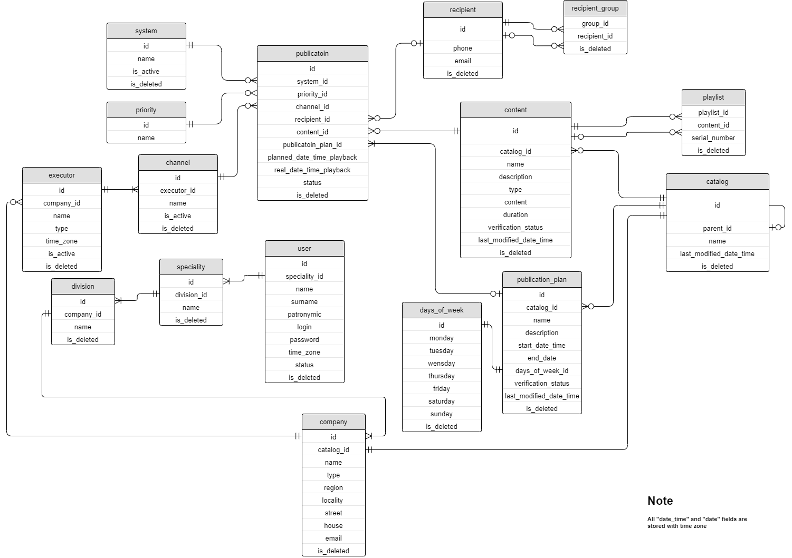
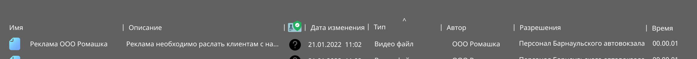

# Система оповещения пассажиров объектов транспортной инфраструктуры с использованием визуальных, звуковых и индивидуальных каналов связи
___
# Постановка задачи
Разработать систему, обеспечивающую:
* Получение из внешних источников информации, которую нужно передать пассажирам объектов
  транспортной инфраструктуры, подключенных к системе.
* Редактирование переданной и создание новой информации такого типа пользователями
  с разными уровнями прав доступа.
* Хранение этой и прочей информации, необходимой для корректной работы системы.
* Логирование действий пользователей.
* Форматирование информации в тот вид, который будет удобен для ее передачи на внешние устройства,
  оповещающие пассажиров.
* Передачу информации на эти устройства во время, указанное пользователем или максимально близкое
  к нему.
* Удобное использование. Визуальный интерфейс системы должен представлять собой диспетчерский терминал.
 Необходимо учесть, что пользователь будет работать долгое время без перерывов, поэтому
  следует снизить зрительную нагрузку - сделать интерфейс понятным, не перегруженным, с мягкой
  цветовой гаммой, акцентирующей важные детали интерфейса.

Основными требованиями к системе являются быстродействие, отказоустойчивость, возможность расширения,
модульность и гибкость.

Система должна быть построена на клиент-серверной архитектуре.

# Средства реализации
## Средства реализации серверной части
* Java development kit 17
* Spring Framework 5.3
* Spring Boot 2.6
* Maven 3.8

## Средства реализации клиентской части
* Html 5
* Css 3
* JavaScript (ECMAScript 6)
* Node JS
* React JS
* Chromium
* Electron

# Проектирование
## Введение
### Основные понятия, используемые в системе
* Событие (event) - ситуация во внешней среде, о которой нужно проинформировать.
События делятся на типы. Когда событие происходит его тип и информация о нем передается внешним источником в систему.
* Шаблон события (event template) - файл, в который подставляется, передаваемая с типом события. Для большинства типов события задан шаблон.
* Действие (action) - операция, совершаемая при обработке события.
* Сценарий (script) - последовательность действий.
* Контент (content) - аудио-, видео- или текстовый файл.
* Плейлист (playlist) - отсортированный список пронумерованного контента, публикуемый и исполняемый целиком.
* Публикация (publication) - совокупность контента и информации о том, как его публиковать
(приоритет публикации, какая система ее создала, кому она адресована, в какое время планируем ее воспроизвести,
в какое время она была воспроизведена, длительность, статус).
* План публикации (publication plan) - алгоритм, описывающий сколько раз, в течении какого отрезка времени нужно повторять публикацию.
* Получатель (recipient) - человек, которого нужно проинформировать о событии или показать ему контент.
* Группа получателей (recipient group) - получатели, объединенные по какому-либо общему признаку. Например, пассажиры одного рейса.

### Основные компоненты системы
* Шлюз событий. Получает из внешней системы тип и информацию о событии, преобразует в формат понятный
  Системе обработки событий и передает системе.
* Хранилище контента – область памяти, предназначенная для хранения объемных файлов.
* База данных.
* Система обработки событий (СОС). Управляет созданием контента по шаблонам, на основе типа и информации о событии.
 Позволяет создавать и редактировать шаблоны, хранит шаблоны и их связи с событиями. На основе сценария создает публикации
  и записывает их в базу данных.
* Система формирования плейлистов вручную/автоматически (ручная/автоматическая СФП). Позволяет создавать и редактировать
  контент, плейлисты и планы публикаций.
* Система управления исполнением (СУИ). Делает выборку публикаций из базы данных, основываясь на приоритете и времени.
 На основе этой выборки сигнализирует шлюзу исполнения о том, что нужно показать тот или иной контент,
  передает шлюзу сам контент или ссылку на него.
* Шлюз исполнения. Забирает контент из хранилища, если необходимо форматирует и передает исполнителю.
* Исполнитель (executor) - внешние устройство, показывающее контент пассажирам. Исполнитель имеет один или более каналов для показа контента.
* Канал (channel) - компонент исполнителя, предназначенный для вывода информации.

  

  
## Общая архитектура серверной части
### Схема взаимодействия компонентов серверной части
Основными классами являются контроллеры, сервисы, репозитории и модели.
* Контроллеры получают данные от клиента, преобразуют их в формат, с которым работает система и наоборот. 
Для обмена информацией с клиентом используются http-запросы с json в теле запроса.
* В сервисе происходит преобразование информации из вида, в котором она хранится в базе, в вид, который используется
для общения с клиентом и наоборот. Так же осуществляется проверка и модификация информации (бизнес-логика).
* Репозиторий осуществляет запросы к базе данных, находит, добавляет, обновляет и удаляет информацию в ней.
* Модель – класс нужный для передачи информации между сервисом, контроллером и репозиторием.

### Схема базы данных

_Примечание. Все поля date_time и date хранятся с часовым поясом._

**system - таблица систем (СОС, СФП)**
* name - наименования системы
* is_active - показывает, в рабочем ли состоянии система (true, false)
* is_deleted - удалена ли система (true, false; записи в базе не удаляются, а помечаются как удаленные)

**executor - таблица исполнителей**
* company_id - id компании, которой принадлежит исполнитель
* name - наименование исполнителя
* type - тип исполнителя (динамик, табло, устройство для отправки смс или электронной почты)
* time_zone - часовой пояс, в котором находится исполнитель
* is_active - показывает, в рабочем ли состоянии устройство (true, false)
* is_deleted - удален ли исполнитель (true, false)

**channel - таблица каналов**
* device_id - id исполнителя, к которому принадлежит канал
* name - наименование канала
* is_active - показывает, в рабочем ли состоянии канал (true, false)
* is_deleted - удален ли канал (true, false)

**recipient - таблица получателей**
* phone - номер телефона
* email - электронная почта
* is_deleted - удален ли получатель (true, false)

**recipient_group - таблица для связи групп и получателей**

Группа получателей хранится в базе как получатель, включающий в себя других получателей.
То есть, если запись в таблице recipient связана с записью в таблице recipient_group по group_id,
то этот получатель является группой. Если запись в таблице recipient связана с записью в таблице recipient_group
по recipient_id, то этот получатель входит в группу.
* group_id - показывает, какая запись в таблице получателей является группой
* recipient_id - показывает, что получатель, id которого записан в этом поле, принадлежит группе, id которой
записан в поле group_id
* is_deleted - удалена ли связь (true, false)

**content - таблица контента**
* catalog_id - id каталога, в котором находится контент
* name - наименование контента
* description - описание контента
* type - тип контента (видео, аудио, текст)
* content - содержание контента (текст или ссылка на файл в хранилище контента)
* duration - длительность контента (для аудио- или видео-контента)
* verification_status - статус проверки (не проверен, допущен, не допущен)
* last_modified_date_time - дата последнего изменения
* is_deleted - удален ли контент (true, false)

**playlist - таблица для связи контента и плейлистов**

Плейлист хранится в базе как контент, содержащий другой контент, аналогично с группой получателей.
* playlist_id - показывает, какой контент является плейлистом
* content_id - показывает, что контент входит в плейлист
* is_deleted - удалена ли связь (true, false)

**catalog - таблица каталогов**
* parent - id каталога, в котором находится данный
* name - наименование каталога
* last_modified_date_time - дата и время последнего изменения
* is_deleted - удален ли каталог (true, false)

**publication_plan - таблица планов публикации**
* catalog_id - id каталога, в котором находится данный план
* name - наименование плана публикации
* description - описание плана публикации
* start_date_time - дата и время начала публикации
* end_date - дата окончания публикации
* days_of_week_id - id записи в таблице days_of_week, показывающей по каким дням недели нужно публиковать
* verification_status - статус проверки (не проверен, допущен, не допущен)
* last_modified_date_time - дата и время последнего изменения
* is_deleted - удален ли план публикации (true, false)

**priority - таблица приоритетов публикации**
* id - чем больше id, тем приоритетнее публикация
* name - наименование приоритета

**publication - таблица публикаций**
* system_id - id системы, создавшей публикацию
* priority_id - id приоритета публикации
* channel_id - id канала, на который будет передана публикация
* recipient_id - id получателя
* content_id - id контента, который содержит публикация
* publication_plan_id - id плана публикации
* planned_date_time_playback - запланированная дата и время публикации
* real_date_time_playback - настоящая дата и время публикации
* status - статус публикации (выполнена, отложена, отменена)
* is_deleted - удалена ли публикация (true, false)

**company - таблица предприятий, работающих в системе**
* catalog_id - каждое предприятие имеет соответсвующий каталог, в котором хранится контент этого предприятия
* name - наименование предприятия
* type - тип предприятия (предположительно: вокзал, рекламодатель, перевозчик)
* region - регион, в котором расположено предприятие
* locality - населенный пункт
* street - улица
* house - номер дома
* email - электронная почта
* is_deleted - удалено ли предприятие (true, false)

**division - таблица подразделений**
* company_id - компания, к которой относится подразделение
* name - имя подразделение
* is_deleted - удалено ли подразделение (true, false)

**speciality - таблица специальностей**
* division_id - id подразделения, к которому относится данная специальность
* name - наименование специальности
* is_deleted - удалена ли специальность (true, false)

**user - таблица пользователей**
* speciality_id - id специальности пользователя
* name - имя
* surname - фамилия
* patronymic - отчество
* login - логин
* password - пароль
* time_zone - часовой пояс, в котором находится пользователь
* status - статус пользователя (предположительно: активен, не активен (отпуск, болезнь), заблокирован)
* is_deleted - удален ли пользователь (true, false)

## Проектирование Системы формирования плейлистов вручную

### Дизайн интерфейса
#### Окно "Проводник"

Общий вид окна

В левом крае окна фрейм "База данных" (выделен красным), который представляет иерархию каталогов.
Корневые папки соответствуют предприятиям, подключенным к системе. При выборе каталога его содержимое отображается правее.

Открытый каталог представляется в виде вкладки (выделены зеленым), там же его можно закрыть.

Строка пути к файлу и поиск выделены фиолетовым. 

Рядом с поиском кнопка, при нажатии на которую открывается фильтр (желтый).

При желании можно разделить экран и отображать сразу два каталога.

Все файлы представляются в виде таблицы со следующими графами:

| Имя |Статус верификации| Описание | Дата изменения | Тип | Автор | Разрешения |
|-----|------------------|----------|----------------|-----|-------|------------|

_Поля "Автор" и "Разрешения" под вопросом, поскольку механизм [логирования действий пользователей][1]
(в частности логирование создания контента) еще не продуман, как и механизм [разделения прав доступа][2] (разрешения)._

#### Окно "Верификация"
В данном окне происходит верификация всей информации в базе данных 
(доступ разграничивается по корневым директориям для каждого отдельного оператора). В таблицу данных [со всех директорий
выгружается не верифицированная информация разного типа][3] (видео, аудио, СМС сообщения и сообщения для электронной почты).
В зависимости от выбранного контента происходит отображение фрейма верификации “Просмотр”.

Фрейм просмотр снабжен полем “Оставить примечание”, где оператор может указать, какие именно элементы не проходят проверку.

[1]: questions.md "1) Как осуществлять логирование?"
[2]: questions.md "2) Как осуществлять разделение прав доступа?"
[3]: questions.md "3) Правильно ли, что в окно верификации выгружается контент со всех директорий?"

